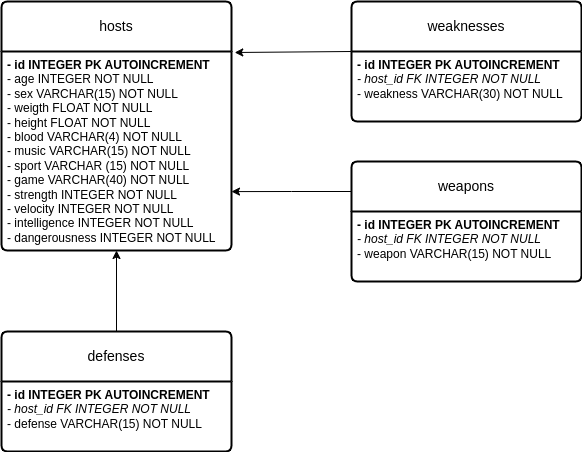
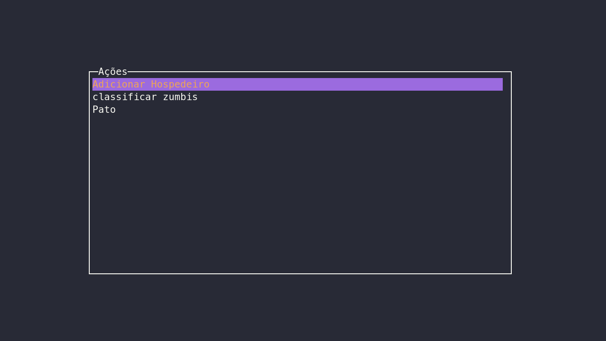
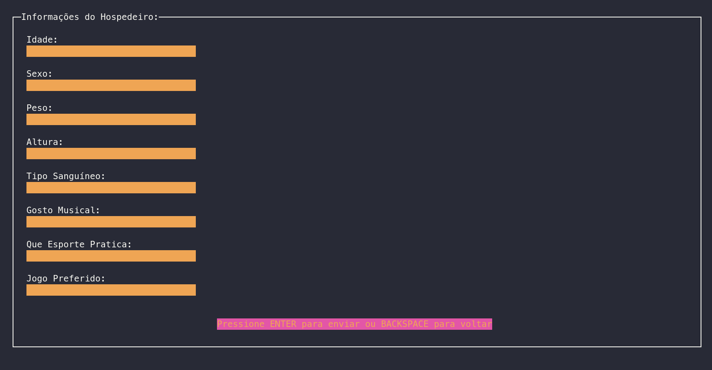
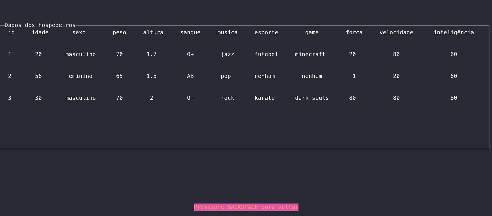
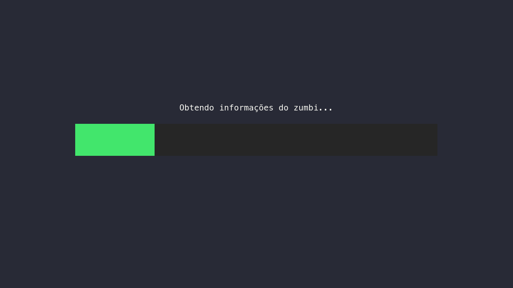
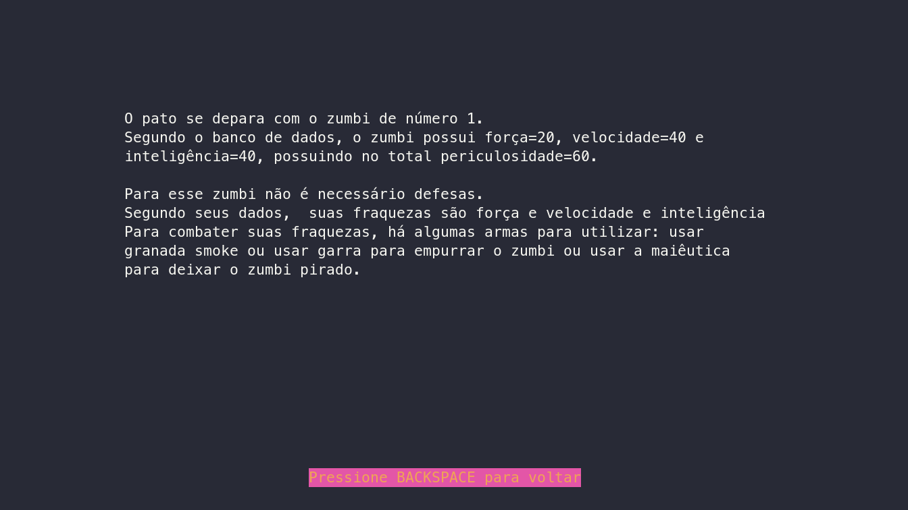

# DSIN codechallenge 2023


https://github.com/Dpbm/coderchallenge-dsin-2023/assets/75098594/5019fba6-dab3-48fd-b0e8-ce6a0b51b74c


Nesse repositório, você encontrará a minha versão do segundo desafio do `DSIN Coderchallenge 2023`.

Minha ideia para esse projeto foi utilizar `nodejs` e a biblioteca `blessed` para criar uma interface interessante baseada em terminal.

Além disso, para o armazenamento dos dados, foi usado o banco de dados `sqlite3`, pela sua simplicidade e velocidade, usando a seguinte estrutura de tabelas:

[](./docs)

Para diminuir o tempo de execução, todas as informações necessárias são processadas apenas uma vez e armazenadas no banco, assim ao precisar de um dado, é necessário apenas acessar uma tabela do sqlite.

## requirimentos

Para executar esse projeto você precisará de:

* [nodejs](https://nodejs.org/en), versão `18.14.0` ou superior
* [npm](https://www.npmjs.com/), ou similar, como um [pnpm](https://pnpm.io/)/[yarn](https://yarnpkg.com/)
* [sqlite3](https://www.sqlite.org/index.html)

além disso, por estar usando `blessed`, é recomendado usar um terminal mais atual como:

* [alacritty](https://github.com/alacritty/alacritty)
* [tilix](https://github.com/gnunn1/tilix)
* [windows terminal](https://github.com/microsoft/terminal)
* [iterm2](https://github.com/microsoft/terminal)
* [tabby](https://github.com/Eugeny/tabby)
* [kitty](https://github.com/kovidgoyal/kitty)

## executar

para executar o projeto, primeiro clone o projeto, entre na pasta e instale todas as dependências:

```bash
git clone https://github.com/Dpbm/coderchallenge-dsin-2023.git
cd coderchallenge-dsin-2023
npm install
```

após tudo instalado, execute o projeto com:

```bash
npm run start
```

Se preferir você pode usar a versão em docker rodando:

```bash
docker run -it dpbm32/coderchallenge-dsin-2023
```

ou

```bash
docker-compose run app
```

`OBS: deixe o terminal em tela cheia para melhor experiência`.

## navegando pelo software

ao executar, você se deparará com uma tela parecida com essa:



para navegar entre o menu, use as setas do teclado (UP e DOWN). Ao para na opção desejada aperte entre para entrar na opção.

### Ação - Adicionar hospedeiro



Na opção `adicionar hospedeiro`, você terá um formulário, para preencher os dados dele, caso algum dado informado não esteja conforme o esperado, uma mensagem aparecerá e mostrará o erro.

Para entrar em cada campo, use, novamente, as setas do teclado (UP e DOWN) e escreva do dado. Ao inserir todos os dados, aperte ENTER uma vez para sair dos campos, e aperte novamente para enviar.

Caso você tenha entrado por engano nessa aba, aperte BACKSPACE e você será retornado para o menu.

### Ação - Classificar zumbis



Nessa opção, você terá uma tabela com todos os dados dos hospedeiros adicionados, incluindo seus dados de força, velocidade e inteligência.

Caso haja muitos dados na tela, use as setas (UP e DOWN) ou o mouse para descer ou subir a lista.

Para retornar ao menu aperte BACKSPACE.

## Ação - Pato



Por fim, a ação `Pato`, simulará o encontro com um zumbi, pegando aleatoriamente no banco um zumbi e descrevendo seus atributos e como o sistema pode fazer para o pato atacar ou se defender.

Após o carregamento, o software mostrará uma mensagem com todos os dados e o que fazer.



Para voltar ao menu pressione BACKSPACE.

## SAIR

Para sair do projeto, aperte Ctrl+c

## TODOS

Devido ao tempo para a produção do projeto, algumas coisas ainda podem ser aprimoradas dentre elas estão:

* abstrair melhor as funções
* utilizar orientação a objetos
* definir melhor as responsabilidades
* melhorar os algoritmos usados

## Problemas

Caso você encontre algum erro ou melhoria durante alguma etapa, sinta-se à vontade para abrir uma issue. E, caso você saiba como resolver, abra um pull request com a sua solução.

Lembre-se de ser gentil e paciente :)
